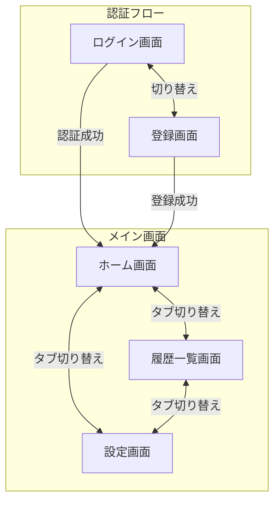

# 画面設計

## 画面遷移図



## 画面一覧

| 画面 | パス | 説明 |
|------|------|------|
| ログイン | `/sign-in` | Clerk SignInコンポーネント |
| 登録 | `/sign-up` | Clerk SignUpコンポーネント |
| ホーム | `/` | 貯金額表示・クイック入力 |
| 履歴 | `/history` | 入力履歴一覧 |
| 設定 | `/settings` | 目標金額変更・アカウント設定 |

## 画面詳細

### 1. 認証画面（Clerk管理）

- Clerkの `<SignIn />`, `<SignUp />` コンポーネントを使用
- カスタムテーマでアプリのデザインに合わせる

### 2. ホーム画面

**目的**: 貯金状況の可視化 + クイック入力（「その瞬間」に入力する体験）

**ワイヤーフレーム**:

```
┌─────────────────────────────────┐
│  現在の貯金額（大きく表示）      │
│        ¥12,500                  │
├─────────────────────────────────┤
│  目標: ¥50,000  達成率: 25%     │
│  [========          ] 25%       │
│  あと ¥37,500                   │
├─────────────────────────────────┤
│  ┌───────────────────────────┐  │
│  │  金額入力（大きなフォーム） │  │
│  │  ¥ [        300        ]  │  │
│  │  [    貯金する！    ]     │  │
│  └───────────────────────────┘  │
├─────────────────────────────────┤
│  最近の記録（3件程度）          │
│  • 今日 - コンビニで我慢 ¥300   │
│  • 昨日 - カフェで我慢 ¥500     │
└─────────────────────────────────┘
│  [ホーム] [履歴] [設定]         │
└─────────────────────────────────┘
```

**主要要素**:
- 貯金額の大きな表示
- 目標達成プログレスバー
- 金額入力フォーム（メイン機能）
- 最近の記録（3件程度）
- ボトムナビゲーション

### 3. 履歴一覧画面

**目的**: 入力履歴の確認・編集・削除

**ワイヤーフレーム**:

```
┌─────────────────────────────────┐
│  履歴                           │
├─────────────────────────────────┤
│  2026年2月                      │
│  ─────────────────              │
│  2/4  コンビニ    ¥300  [編集]  │
│  2/3  カフェ      ¥500  [編集]  │
│  2/1  コンビニ    ¥250  [編集]  │
│  ─────────────────              │
│  2026年1月                      │
│  ─────────────────              │
│  1/31 ネット     ¥2,000 [編集]  │
│  ...                            │
└─────────────────────────────────┘
│  [ホーム] [履歴] [設定]         │
└─────────────────────────────────┘
```

**主要要素**:
- 月別グループ化されたリスト
- 各エントリーの編集・削除機能
- 無限スクロール or ページネーション

### 4. 設定画面

**目的**: 目標金額の変更、アカウント設定

**ワイヤーフレーム**:

```
┌─────────────────────────────────┐
│  設定                           │
├─────────────────────────────────┤
│  目標金額                       │
│  ¥ [    50,000    ]  [変更]    │
├─────────────────────────────────┤
│  アカウント                     │
│  user@example.com               │
│  [ログアウト]                   │
├─────────────────────────────────┤
│  このアプリについて              │
│  バージョン 1.0.0               │
└─────────────────────────────────┘
│  [ホーム] [履歴] [設定]         │
└─────────────────────────────────┘
```

**主要要素**:
- 目標金額設定
- アカウント情報（Clerkから取得）
- ログアウトボタン
- アプリ情報

## 共通コンポーネント

### ボトムナビゲーション

- 3タブ構成: ホーム / 履歴 / 設定
- 現在のタブをハイライト
- PWA対応（Safe Area考慮）

## UX設計ポイント

1. **クイック入力重視**
   - ホーム画面で金額入力がすぐできる配置
   - 数字入力に最適化（type="number", inputmode="numeric"）

2. **視覚的フィードバック**
   - 貯金成功時のアニメーション
   - プログレスバーの動き

3. **モバイルファースト**
   - タップしやすいボタンサイズ（44px以上）
   - 片手操作を考慮した配置

4. **PWA対応**
   - オフライン時の動作
   - ホーム画面追加時のアイコン・スプラッシュ
