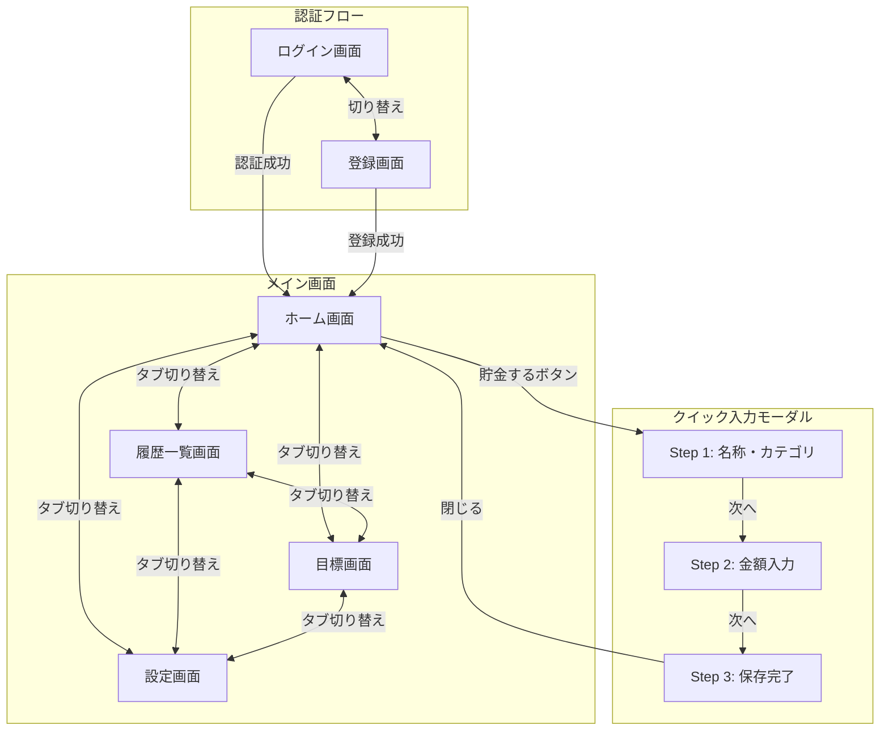

# 画面設計

## デザイン方針

> 詳細は [DESIGN.md](./DESIGN.md) を参照

- **テーマ**: 豚の貯金箱（Piggy Bank） — シンプルな豚キャラクターがどんどんリッチになっていく世界観
- **カラー**: Warm Honey Gold（Primary）+ Soft Coral Pink（Secondary）+ Creamy Off-White → Pink グラデーション背景
- **トーン**: 日本語ポップ、明るく親しみやすい、励ましの雰囲気
- **タイポグラフィ**: Noto Sans JP + Inter
- **形状**: 丸みのあるコンポーネント（Pill-shaped ボタン、Rounded カード）
- **モバイルファースト**: 375px 基準、片手操作前提、Web アプリ（PWA）

## 画面遷移図



## 画面一覧

| 画面 | パス | 説明 |
|------|------|------|
| ログイン | `/sign-in` | Clerk SignInコンポーネント |
| 登録 | `/sign-up` | Clerk SignUpコンポーネント |
| ホーム | `/` | 貯金額表示・CTAボタン・最近の記録 |
| クイック入力モーダル | (モーダル) | ステップ式の貯金記録入力 |
| 履歴 | `/history` | 入力履歴一覧 |
| 目標 | `/goal` | 目標の名前・金額・進捗表示 |
| 設定 | `/settings` | アカウント設定 |

## 画面詳細

### 1. 認証画面（Clerk管理）

- Clerkの `<SignIn />`, `<SignUp />` コンポーネントを使用
- カスタムテーマでアプリのデザインに合わせる

### 2. ホーム画面

**目的**: 貯金状況の可視化 + クイック入力への導線（「その瞬間」に入力する体験）

**ワイヤーフレーム**:

```
┌─────────────────────────────────┐
│  🐷 つもり貯金            🔔   │
├─────────────────────────────────┤
│         [貯金総額]              │
│        ¥12,500                  │
│                                 │
│  スタート [========] ゴール     │
│              (¥50,000)          │
├─────────────────────────────────┤
│  ┌───────────────────────┐     │
│  │  🐷 キャラクター      │     │
│  │  (プレースホルダー)    │     │
│  └───────────────────────┘     │
├─────────────────────────────────┤
│  [    🐷 貯金する！（CTA）   ] │
├─────────────────────────────────┤
│  ● 最近の記録       すべて見る  │
│  ┌─────────────────────────┐   │
│  │ 🛒 10/24 カフェで我慢  +¥500│
│  ├─────────────────────────┤   │
│  │ 🍱 10/22 お弁当にした  +¥800│
│  ├─────────────────────────┤   │
│  │ 💰 10/20 おつりを貯金  +¥200│
│  └─────────────────────────┘   │
├─────────────────────────────────┤
│  [ホーム] [履歴] [目標] [設定] │
└─────────────────────────────────┘
```

**主要要素**:
- 貯金総額の大きな表示（Honey Gold）
- プログレスバー（Gold fill + Pink track）
- 豚キャラクターエリア（プレースホルダー、後日イラスト差し替え）
- 「貯金する！」CTAボタン → タップでクイック入力モーダルを開く
- 最近の記録（3件、カテゴリアイコン付きカード）
- 4タブボトムナビゲーション

### 2.5. クイック入力モーダル（ステップ式）

**目的**: インタラクティブで楽しい、集中できる貯金記録の入力体験

**形式**: ボトムシート形式のモーダル（画面の約70%をカバー）

**Step 1: 名称・カテゴリ選択**（何を我慢した？）

```
┌─────────────────────────────────┐
│         ─── (ドラッグハンドル)   │
│  ● ○ ○  (ステップインジケーター) │
├─────────────────────────────────┤
│  何を我慢した？                  │
│                                 │
│  [  例: コンビニのお菓子      ] │
│                                 │
│  [コンビニ] [カフェ] [外食]     │
│  [ネット通販] [その他]          │
│                                 │
│    [      次へ →      ]        │
└─────────────────────────────────┘
```

**Step 2: 金額入力**（いくら分？）

```
┌─────────────────────────────────┐
│         ─── (ドラッグハンドル)   │
│  ○ ● ○  (ステップインジケーター) │
├─────────────────────────────────┤
│  いくら分？                     │
│                                 │
│          ¥ 500                  │
│    （大きな金額入力フィールド）   │
│    （OSネイティブキーボード使用） │
│                                 │
│           戻る                  │
│    [      次へ →      ]        │
└─────────────────────────────────┘
```

**Step 3: 保存完了**（フィードバック）

```
┌─────────────────────────────────┐
│         ─── (ドラッグハンドル)   │
│  ● ● ●  (ステップインジケーター) │
├─────────────────────────────────┤
│                                 │
│          🐷✨                   │
│   （リッチになった豚キャラ）     │
│                                 │
│    ¥300 貯金しました！          │
│    合計: ¥12,800                │
│                                 │
│    [      閉じる      ]         │
└─────────────────────────────────┘
```

**主要要素**:
- ボトムシート形式（スワイプダウンで閉じる）
- ステップインジケーター（3ドット、Gold ハイライト）
- Step 1: テキスト入力 + カテゴリチップ選択
- Step 2: 大きな金額入力フィールド（OS キーボード使用、Web アプリのため）
- Step 3: 豚キャラの祝福演出 + 貯金額サマリー

### 3. 履歴一覧画面

**目的**: 入力履歴の確認・編集・削除

**ワイヤーフレーム**:

```
┌─────────────────────────────────┐
│  ← 履歴                        │
├─────────────────────────────────┤
│  今月の貯金総額                  │
│  ¥12,850                  🐷   │
├─────────────────────────────────┤
│  📅 2026年2月                   │
│  ─────────────────              │
│  🛒 24(火) カフェで我慢    +¥300│
│  🍱 22(日) お弁当持参券   +¥500│
│  👕 18(水) 服を買うのを我慢     │
│                          +¥2,500│
│  ─────────────────              │
│  📅 2026年1月                   │
│  ─────────────────              │
│  🚶 15(金) 一駅歩いた    +¥250 │
│  🍺 10(土) 飲み会を断った       │
│                          +¥4,000│
│  🍫 05(月) コンビニスイーツ我慢 │
│                          +¥350  │
├─────────────────────────────────┤
│  [ホーム] [履歴] [目標] [設定] │
└─────────────────────────────────┘
```

**主要要素**:
- 今月の貯金総額サマリーカード（Coral Pink 背景）
- 月別グループ化されたリスト（スティッキーヘッダー）
- カテゴリアイコン + 日付 + 名称 + 金額（Gold）
- 各エントリーのタップで編集
- 無限スクロール

### 4. 目標画面

**目的**: 目標の名前・金額・進捗の確認

**ワイヤーフレーム**:

```
┌─────────────────────────────────┐
│  目標                           │
├─────────────────────────────────┤
│                                 │
│  新しいヘッドフォン              │
│        ¥30,000                  │
│                                 │
│     ┌──────────────┐           │
│     │  42%          │           │
│     │ (円形ゲージ)  │           │
│     │              │           │
│     │ ¥12,500      │           │
│     │ / ¥30,000    │           │
│     └──────────────┘           │
│                                 │
│     あと ¥17,500                │
│                                 │
│  [    目標を変更    ]           │
├─────────────────────────────────┤
│  ● 最近の貯金                   │
│  🛒 カフェで我慢         +¥300  │
│  🍱 お弁当にした         +¥500  │
├─────────────────────────────────┤
│  [ホーム] [履歴] [目標] [設定] │
└─────────────────────────────────┘
```

**主要要素**:
- 目標名の表示（テキスト）
- 目標金額の大きな表示（Honey Gold）
- 円形プログレスゲージ（Gold fill + Pink track、達成率%）
- 残額表示
- 「目標を変更」ボタン（Coral Pink アウトライン）
- 最近の貯金エントリー
- 4タブボトムナビゲーション

### 5. 設定画面

**目的**: 表示・通知・データ管理などの各種設定

> **注**: 目標管理は目標画面、ログイン/アカウント管理は別途実装予定のため設定画面には含まない。

**ワイヤーフレーム**:

```
┌─────────────────────────────────┐
│  ← 設定                        │
├─────────────────────────────────┤
│  ● 表示                        │
│  ┌─────────────────────────┐   │
│  │ テーマ                 › │   │
│  │─────────────────────────│   │
│  │ 通貨・単位             › │   │
│  └─────────────────────────┘   │
├─────────────────────────────────┤
│  ● 通知                        │
│  ┌─────────────────────────┐   │
│  │ リマインダー           › │   │
│  └─────────────────────────┘   │
├─────────────────────────────────┤
│  ● データ                      │
│  ┌─────────────────────────┐   │
│  │ エクスポート           › │   │
│  │─────────────────────────│   │
│  │ リセット               › │   │
│  │ すべてのデータを削除    │   │
│  └─────────────────────────┘   │
├─────────────────────────────────┤
│  ● アプリ情報                  │
│  ┌─────────────────────────┐   │
│  │ バージョン              │   │
│  │ 0.1.0                   │   │
│  └─────────────────────────┘   │
├─────────────────────────────────┤
│  [ホーム] [履歴] [目標] [設定] │
└─────────────────────────────────┘
```

**主要要素**:
- `SubPageLayout` によるヘッダー（戻るボタン付き）
- セクション区切り: `SectionHeader`（ドット + セクション名）
- 設定行: `SettingsItem`（ラベル・description・`ChevronRight` アイコン）
- 現在は全項目ビジュアルのみ（非インタラクティブ）
- 4タブボトムナビゲーション

**セクション構成**:

| セクション | 項目 | description |
|---|---|---|
| 表示 | テーマ | — |
| 表示 | 通貨・単位 | — |
| 通知 | リマインダー | — |
| データ | エクスポート | — |
| データ | リセット | すべてのデータを削除 |
| アプリ情報 | バージョン | 0.1.0 |

## 共通コンポーネント

### ボトムナビゲーション

- 4タブ構成: ホーム / 履歴 / 目標 / 設定
- アクティブタブ: Honey Gold アイコン + ラベル
- 非アクティブタブ: ウォームグレー アイコン + ラベル
- PWA対応（Safe Area考慮）

### 豚キャラクター

- シンプルなイラスト（後日作成・差し替え）
- 登場箇所: ホーム画面（メイン）、Step 3 完了画面、履歴サマリー
- 貯金額に応じてキャラが変化（将来機能）

## UX設計ポイント

1. **クイック入力重視**
   - ホーム画面の目立つCTAボタンからワンタップでモーダルを開く
   - ステップ式で入力に集中できるUX（1画面1アクション）
   - Web アプリのため OS ネイティブキーボードを使用
   - 数字入力に最適化（inputmode="numeric"）

2. **視覚的フィードバック**
   - 貯金成功時の豚キャラクター演出（Step 3）
   - プログレスバー / ゲージのアニメーション
   - モーダルのスライドアップ/ダウンアニメーション

3. **モバイルファースト**
   - タップしやすいボタンサイズ（44px以上）
   - 片手操作を考慮した配置（CTAは親指の届く位置に）
   - ボトムシート形式のモーダルで自然な操作感

4. **PWA対応**
   - オフライン時の動作
   - ホーム画面追加時のアイコン・スプラッシュ

5. **デザインの一貫性**
   - [DESIGN.md](./DESIGN.md) をソースオブトゥルースとしたデザインシステム
   - 豚キャラクター + Honey Gold + Coral Pink の統一されたテーマ
   - クリーミーホワイト → ピンクのグラデーション背景で全画面統一
